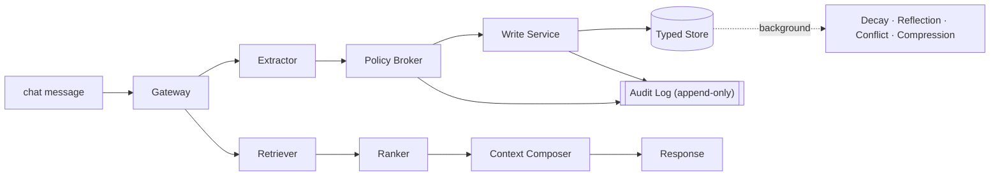

# MemoryOps AI

MemoryOps AI is an enterprise-shaped, loop-engineered memory governance layer for AI assistants.
It implements a ChatGPT-style memory lifecycle with capture, policy evaluation, typed storage,
hybrid retrieval, controlled forgetting, auditability, and tenant isolation.

Most demos treat memory as a vector database. MemoryOps AI treats memory as **governed state**.

> **Tagline:** Enterprise memory governance for AI assistants.
> **Core claim:** Memory is not a database. Memory is a governed decision system that decides what
> information is valuable enough to carry into the future.

---

## Why this exists

Most AI "memory" demos do this:

```text
chat message → vector database → retrieve later
```

MemoryOps AI does this:

```text
WRITE PATH
Message → Extractor → Evaluator / Policy Broker → Write Service → Typed Memory Stores → Audit Log

READ PATH
Message → Retriever → Ranker → Context Composer → Response LLM

BACKGROUND
Decay Job → Reflection Agent → Conflict Resolver → Compression Worker

CROSS-CUTTING PLANES
Security · Governance · Observability · Evaluation · Reliability
```

The five verbs the system must demonstrate:

```text
Capture → Store → Retrieve → Update → Forget   (Governance wraps all five)
```



More diagrams (system architecture, lifecycle state machine, request sequence) are
in [docs/architecture.md](docs/architecture.md#diagrams).

---

## Enterprise invariants

These are non-negotiable and are enforced in code and tests.

1. **Tenant isolation** — User A's memory is never returned to User B or another tenant.
2. **Deletion guarantee** — Deleted memories are never retrieved again.
3. **Provenance** — Every stored memory traces back to its source message/document/manual input.
4. **Graceful degradation** — Retrieval failure never blocks response generation.
5. **Policy-before-storage** — Unsafe / secret-like content is filtered before it reaches the store.
6. **Temporary chat** — Temporary sessions never write or retrieve memory.
7. **Auditability** — Every memory lifecycle event produces an append-only audit event.
8. **Explainability** — The system can show which memories affected a response.
9. **Typed memory** — Episodic, semantic, procedural, project, knowledge, system memories differ.
10. **Evaluation** — Memory quality is testable through a golden set, not just manual inspection.

See [docs/architecture.md](docs/architecture.md) for the full design and where each invariant is
enforced.

---

## Repository layout

```text
memoryops-ai/
  apps/web/            Next.js frontend (chat, memories, governance, audit, loops, admin, architecture)
  apps/results-dashboard/ Public read-only Streamlit results/evidence dashboard (demo-only; v0.9)
  apps/playground/     Interactive Streamlit playground over the real pipeline (demo-only, in-memory; v0.12)
  services/api/        FastAPI backend (gateway, extractor, policy broker, write/read path, audit)
  services/worker/     Background jobs (decay, reflection, conflict resolution, compression)
  packages/memoryops-sdk/ Python SDK + integration examples (quickstart, FastAPI, RAG, agent) (v0.11)
  packages/shared/     Shared types
  infra/db/            Postgres + pgvector migrations and seed
  infra/adr/           Architecture Decision Records
  infra/observability/ OpenTelemetry / metrics notes
  evals/               Golden + adversarial cases and the eval runner
  docs/                architecture, security, governance, rollout, demo-script
  docker-compose.yml
```

---

## Quickstart

### Option A — API only, no infra (fastest)

The API ships with an in-memory repository so you can run the write path and tests without Postgres.

```bash
cd services/api
python -m venv .venv && source .venv/bin/activate
pip install -r requirements.txt
export MEMORYOPS_STORAGE=memory          # default; uses in-memory store
uvicorn app.main:app --reload --port 8000
# open http://localhost:8000/docs
```

Run the invariant test suite:

```bash
cd services/api
pip install -r requirements-dev.txt
pytest -q
```

Run the eval harness against a running API (or in-process):

```bash
cd evals
python run_evals.py
```

### Option B — Full stack with Docker Compose

```bash
cp .env.example .env
docker compose up --build
# web  → http://localhost:3000
# api  → http://localhost:8000/docs
# db   → localhost:5432 (postgres/pgvector)
# redis→ localhost:6379
```

Compose runs migrations from `infra/db/migrations` on first boot and sets
`MEMORYOPS_STORAGE=postgres` for the API.

### Embeddings (v0.3)

Retrieval uses a swappable embedding provider. The default is a deterministic,
offline **stub** — no API key required — so tests and demos are reproducible.

```bash
export MEMORYOPS_EMBEDDING_PROVIDER=stub     # default; deterministic, no key
# optional real embeddings:
export MEMORYOPS_EMBEDDING_PROVIDER=openai
export OPENAI_API_KEY=sk-...
export OPENAI_EMBEDDING_MODEL=text-embedding-3-small
```

An unconfigured or failing provider degrades to the stub, and a query-embedding
failure degrades retrieval to keyword-only (`retrieval_mode="fallback"`).

### LLM provider adapters (v0.4)

Extraction and conflict detection run through a provider-neutral LLM layer
(`app/llm/`). The default is a deterministic, offline **stub** — no API key — so
behavior is reproducible and tests never touch the network. Optional OpenAI,
Anthropic, and Gemini adapters are used only when their key is set.

```bash
export MEMORYOPS_LLM_PROVIDER=stub          # default; deterministic, no key
# optional real providers (used only when the key is present):
export MEMORYOPS_LLM_PROVIDER=anthropic
export ANTHROPIC_API_KEY=...   ANTHROPIC_MODEL=claude-haiku-4-5-20251001
# also: openai (OPENAI_API_KEY/OPENAI_MODEL), gemini (GEMINI_API_KEY/GEMINI_MODEL)
export MEMORYOPS_LLM_FALLBACK_TO_HEURISTIC=true   # invalid JSON / failure → heuristic
```

LLM output is **advisory**: the deterministic policy broker runs after extraction
and stays authoritative — a model can never override policy, and secret-like
content is still blocked. See [docs/provider-llm-adapters.md](docs/provider-llm-adapters.md),
[docs/structured-memory-intelligence.md](docs/structured-memory-intelligence.md),
and [ADR-008](infra/adr/ADR-008-provider-llm-adapters.md).

Verify enforced Row-Level Security against a running Postgres:

```bash
python scripts/check_rls_policies.py        # SKIPs cleanly if no DB is reachable
```

### Frontend

```bash
cd apps/web
npm install
npm run dev          # http://localhost:3000
```

The frontend reads `NEXT_PUBLIC_API_URL` (defaults to `http://localhost:8000`).

---

## Deployment — Railway only (v0.3.2)

MemoryOps deploys to **Railway only**. There is **no Vercel** path. One Railway
project (`memoryops-ai`) runs five services:

| Service | Role | Source |
|---------|------|--------|
| `memoryops-web` | Next.js frontend | `apps/web/Dockerfile` |
| `memoryops-api` | FastAPI backend | `services/api/Dockerfile` |
| `memoryops-worker` | Background loops | `services/worker/Dockerfile` |
| Railway Postgres | Store + pgvector | plugin |
| Railway Redis | Queue / cache | plugin |

Build/deploy is config-as-code under [`railway/`](railway/). Docs:

- [docs/deployment/railway.md](docs/deployment/railway.md) — topology, order, rollback
- [docs/deployment/railway-env.md](docs/deployment/railway-env.md) — env var matrix
- [docs/deployment/railway-smoke-test.md](docs/deployment/railway-smoke-test.md) — post-deploy checks

Post-deploy verification:

```bash
python scripts/railway_smoke_test.py \
  --api-url https://memoryops-api.up.railway.app \
  --web-url https://memoryops-web.up.railway.app
```

---

## What works today (Phase 0 + Phase 1)

- Full design spine: README, architecture/security/governance/rollout docs, 5 ADRs, DB schema.
- FastAPI write path: **Gateway → Extractor → Policy Broker → Write Service → Memory Store → Audit**.
- Heuristic extractor + policy broker (works with **no API keys**); pluggable LLM adapter interface.
- Typed memory classification, importance/confidence/sensitivity scoring, provenance capture.
- Policy decisions: `SAVE`, `PENDING_APPROVAL`, `BLOCK`, `DROP_LOW_UTILITY`, `UPDATE_EXISTING`, `MERGE_WITH_EXISTING`.
- Secret / PII detection blocks API keys and credentials before storage.
- Append-only audit log for every lifecycle event.
- Temporary chat short-circuits both read and write.
- Memory dashboard + admin/audit + architecture pages (frontend skeleton).
- Invariant test suite + eval harness scaffolding.

## Loop Engineering Layer (v0.3.1)

MemoryOps models memory as a set of governed loops rather than a passive store.

The core loops are:

1. Memory Write Loop
2. Memory Read Loop
3. Governance Loop
4. Evaluation Loop
5. Release Gate Loop
6. Continuous Learning Loop

Each loop has explicit states, policy gates, audit events, fallback behavior, and
evidence requirements. Loop definitions live in `services/api/app/loops/`, loop
runs/events are exposed through `/api/loops`, and the frontend includes a Loops page.

See [docs/loop-engineering.md](docs/loop-engineering.md),
[docs/loop-contracts.md](docs/loop-contracts.md), and
[docs/release-loop.md](docs/release-loop.md).

## Token Compression Layer (v0.2.1)

MemoryOps supports an optional [Headroom](https://github.com/chopratejas/headroom)-powered
context compression layer. Compression runs **after** policy checks, governance
filtering, and context composition, and **only** on the composed context block —
never the raw user message and never before the policy broker. It reduces tokens
sent to the LLM while preserving MemoryOps invariants (provenance, deletion
guarantee, tenant isolation, temporary-chat behavior, explainability metadata).

It is **off by default** and **not a dependency** — the app runs without
`headroom-ai` installed, and any compression failure degrades safely to the
uncompressed context.

```bash
pip install "headroom-ai[all]"            # optional
export MEMORYOPS_CONTEXT_COMPRESSION=headroom   # default: none
```

Each chat response carries a `compression` block with estimated tokens saved and
the compression ratio. See [docs/token-compression.md](docs/token-compression.md),
[docs/integrations/headroom.md](docs/integrations/headroom.md), and
[ADR-007](infra/adr/ADR-007-headroom-token-compression.md). Headroom is Apache-2.0;
MemoryOps integrates it via an adapter and does not vendor its source.

## What works as of v0.3 (real data layer)

- Swappable embedding provider (`app/embeddings/`): deterministic offline stub + optional OpenAI.
- **Hybrid retrieval**: pgvector cosine (`search_candidates`) + keyword overlap, blended by the ranker.
- Per-memory **`score_breakdown`** + response **`retrieval_mode`** (`hybrid` / `fallback` / `none`).
- **Enforced** Postgres Row-Level Security (migration `004`, `FORCE` + tenant policy + session GUC).
- Expanded evals (semantic / keyword / archived / score-breakdown) + new tests; RLS test is DB-guarded.

## What works as of v0.4 (provider LLM adapters)

- Provider-neutral LLM layer (`app/llm/`): deterministic `StubProvider` default +
  optional OpenAI/Anthropic/Gemini adapters, selected by `MEMORYOPS_LLM_PROVIDER`.
- **Structured memory intelligence**: schema-validated extraction + minimal conflict
  detection, with prompt registry and deterministic heuristic fallback.
- Invalid JSON / provider failure / timeout degrades to the heuristic and never
  blocks chat; LLM output is advisory and cannot override the policy broker.
- New observability events (`llm_provider_call`, `llm_provider_failure`,
  `structured_output_invalid`, `llm_fallback_used`, `memory_extraction_structured`,
  `conflict_detection_result`) + `structured`/`conflict` evals; tests need no API keys.

## What works as of v0.5 (governance UI + memory control plane)

- Browser control plane over the governed lifecycle: `/memories` (filterable
  inventory), `/memories/[id]` (detail + provenance + per-memory audit timeline +
  inline edit), `/governance` (approval queue + recorded policy decisions),
  `/audit` (tenant-wide append-only history).
- Additive read routes: `GET /api/memories/{id}`, `/{id}/provenance`,
  `/{id}/audit`, plus a `memory_id` filter on `/api/audit`. Approve/reject/edit/
  archive/restore/delete reuse the existing PATCH/DELETE — every action is audited
  and the policy broker stays authoritative.
- Deletion guarantee holds in the UI: deleted memories are never listed or shown
  as active. Provenance is metadata only (no embeddings/secrets).
- See [docs/governance-ui.md](docs/governance-ui.md),
  [docs/memory-control-plane.md](docs/memory-control-plane.md), and
  [ADR-009](infra/adr/ADR-009-memory-control-plane.md).

## What works as of v0.6 (background memory lifecycle workers)

- Background workers (`services/api/app/workers/`) maintain memory **after**
  capture, off the chat request path: **decay** (demote aged/low-confidence
  memory), **archive** (retire stale, non-pinned, not-recently-used memory),
  **conflict scan** (flag contradictions as review candidates), **deletion
  verification** (prove soft-deleted memory stays unreachable), and proposal-only
  **reflection** (off by default).
- A tenant-scoped `runner` drives them:
  `python -m app.workers.runner --tenant t1 --user u1 --job all` (returns a
  structured `WorkerRunReport`; non-zero exit on a failed job or deletion finding).
- Every job is tenant scoped, idempotent, retry-safe, and audited; none resurrects
  deleted memory and none bypasses the policy broker. A worker failure never
  blocks chat.
- See [docs/background-lifecycle-workers.md](docs/background-lifecycle-workers.md),
  [docs/memory-decay-policy.md](docs/memory-decay-policy.md),
  [docs/deletion-verification.md](docs/deletion-verification.md), and
  [ADR-010](infra/adr/ADR-010-background-memory-lifecycle-workers.md).

## What works as of v0.7 (deletion compaction + vector purge verification)

- A sixth lifecycle job — **deletion compaction** — clears a soft-deleted memory's
  content, normalized content, embedding/vector material, and provenance excerpt
  (after a retention window), while **preserving the governance tombstone** (id,
  tenant/user, `status='deleted'`, `deleted_at`, `source.kind`) and the full audit
  trail. Run it with
  `python -m app.workers.runner --tenant t1 --user u1 --job deletion_compaction`.
- The purge is **verified fail-closed**: a still-reachable id, intact material, a
  missing tombstone, or a verification-path error all record evidence and flag the
  run — never a silent pass.
- Honest scope: this is **auditable content/vector compaction + retrieval-exclusion
  verification**. It is **not** crypto-shred and does **not** claim physical
  disk/page erasure or pgvector reindex orchestration.
- See [docs/deletion-compaction.md](docs/deletion-compaction.md),
  [docs/vector-purge-verification.md](docs/vector-purge-verification.md), and
  [ADR-011](infra/adr/ADR-011-physical-deletion-compaction-vector-purge.md).

## What works as of v0.8 (worker runtime + scheduled orchestration)

- The lifecycle jobs are now **operable**, not just callable: a **lease/lock**
  prevents duplicate concurrent runs of a scope, a **retry/backoff** policy
  absorbs transient faults, exhausted retries become **dead-letter** records, and
  every run is persisted as content-free **run history**.
- A thin **scheduler** drives the orchestrator over explicit `"tenant:user"`
  scopes; `services/worker/main.py` now runs the real lifecycle workers.
- **Worker health is visible** at `GET /healthz/workers` (recent runs, dead-letter
  / failure counts, last run per scope). New migration `006_worker_runtime.sql`.
- Leases expire, so a crashed worker never deadlocks a scope; multiple replicas
  are safe (the lease arbitrates). No queue/broker added.
- See [docs/worker-runtime.md](docs/worker-runtime.md) and
  [ADR-012](infra/adr/ADR-012-worker-runtime-orchestration.md).

## What works as of v0.9 (public results dashboard + evidence explorer)

- A **read-only public results dashboard** ([`apps/results-dashboard/`](apps/results-dashboard))
  built with Streamlit makes MemoryOps understandable and inspectable: overview,
  version timeline, memory lifecycle, **deletion compaction proof**, worker
  runtime results, audit evidence, validation results, and honest limitations.
- It is **demo/evidence UI only** — static demo JSON, no live DB, no secrets, no
  auth, no writes. The Next.js app in `apps/web` remains the official product UI.
- Run it with `cd apps/results-dashboard && pip install -r requirements.txt &&
  streamlit run app.py`. See [docs/results-dashboard.md](docs/results-dashboard.md).

## What works as of v0.10 (retention + legal hold + consent-aware memory)

- **Retention policy packs** (sensitivity tier → retention window: `default` /
  `strict` / `extended`) drive a new `retention` lifecycle worker that soft-deletes
  expired or consent-revoked memory — then the v0.7 deletion-verification +
  compaction pipeline takes over. **OFF by default**; a disabled/dry run records
  an admin-readable decision preview without deleting.
- **Legal hold** is a fail-closed override that blocks **all** forgetting (decay,
  archive, retention, compaction) and the API delete route (`DELETE` → HTTP 409).
  A held memory's content is *preserved* for discovery — a preservation control,
  **not** crypto-shred.
- **Consent-aware memory** records consent (`granted`/`withdrawn`/`expired`/
  `not_required`); withdrawn/expired consent makes memory eligible for deletion.
  Pins exempt from decay/archive; protection exempts from retention auto-deletion.
- Governance state is metadata-driven (new migration `007_…`) and every change is
  audited. Admin surface: `/api/retention/*`. See
  [docs/retention-policies.md](docs/retention-policies.md) and
  [ADR-013](infra/adr/ADR-013-retention-legal-hold-consent.md).

## What works as of v0.11 (assistant SDK + integration examples)

- A typed **Python SDK** ([`packages/memoryops-sdk/`](packages/memoryops-sdk))
  wraps the governed HTTP API (chat, memories, retention/legal-hold/consent,
  audit, metrics, loops, health) and injects the tenant/user scope on every call.
  The **server stays authoritative** for all governance — the SDK adds none of
  its own.
- Runnable **integration examples**: quickstart, a FastAPI assistant endpoint, a
  RAG assistant (governed user memory + your RAG docs), and an agent-memory tool.
- Typed errors (`LegalHoldError`, `NotFoundError`, `APIError`) and an injectable
  `httpx.Client` for in-process testing (the SDK is tested against the real app).
- `pip install -e packages/memoryops-sdk`. See
  [docs/assistant-sdk.md](docs/assistant-sdk.md) and
  [ADR-014](infra/adr/ADR-014-assistant-sdk.md).

## What works as of v0.12 (interactive playground + hosted demo)

- An **interactive public Playground** ([`apps/playground/`](apps/playground))
  that *drives the real governed pipeline in-process* — capture → ask a question
  that uses memory → apply a legal hold / withdraw consent / delete / run the
  lifecycle workers → watch the audit trace and assistant behavior change live.
- **Safe to host:** a fresh **in-memory** store per browser session — no database,
  no auth, no secrets, no network (stub LLM + embeddings), no real user data. It
  drives the same `services/api` governance code the product uses, so behavior is
  faithful, not a reimplementation.
- The v0.9 [results dashboard](apps/results-dashboard) remains the read-only
  **evidence** view; the playground is the public **entry point**.
- Run it: `cd apps/playground && pip install -r requirements.txt &&
  streamlit run streamlit_app.py`. Screenshots/GIF + the hosted demo link are the
  operator-run final step (see [docs/images/playground/](docs/images/playground/)).
  See [docs/playground.md](docs/playground.md).

## Roadmap

- **v0.7** — physical deletion compaction + vector purge verification ✅
- **v0.8** — worker runtime + scheduled lifecycle orchestration ✅
- **v0.9** — public results dashboard + evidence explorer ✅
- **v0.10** — retention policies + legal hold + consent-aware memory ✅
- **v0.11** — assistant SDK + integration examples ✅
- **v0.12** — interactive playground + hosted demo + public screenshots ✅
- **v1.0** — production-ready governed memory runtime

## What remains (v1.0)

- Production-ready runtime: stable API + SDK contracts, deployment guide, README
  polish, the hosted demo link + recorded GIF wired into the hero.
- Consent *capture* at the UI/SDK edge; cross-tenant retention scheduling.
- Hard purge / crypto-shred and pgvector index reclamation (beyond v0.7's
  auditable compaction).
- Optional queue/cron backend behind the orchestrator interface; auto-discovered
  scope enumeration.
- Observability + economics, AI PR review runtime, deployment hardening.

See [docs/rollout.md](docs/rollout.md) and the build phases in [CLAUDE.md](CLAUDE.md).

---

## Agentic Engineering Layer

MemoryOps AI includes an agentic engineering layer **around** the core memory
system (never on the chat request path). It is inspired by three systems:

1. **Hermes Agent** — used as an operator/developer assistant layer for release
   checks, invariant audits, and guided project workflows. See
   [`.hermes/skills/`](.hermes/skills/) and [docs/integrations/hermes-agent.md](docs/integrations/hermes-agent.md).
2. **agentic-swe-kit** — used as a phase-gate framework for production engineering.
   MemoryOps maps to lifecycle phases covering cognitive design, memory
   architecture, evaluation, observability, security, reliability, governance,
   CI/CD for AI, and continuous learning. See
   [docs/agentic-swe-kit-map.md](docs/agentic-swe-kit-map.md) and
   [docs/phase-gates/](docs/phase-gates/).
3. **AI PR Review Agent** — the pattern behind the **PR Invariant Evidence Gate**.
   Every PR that touches memory, policy, retrieval, deletion, security, migrations,
   or API contracts must provide evidence (tests / evals / docs / ADRs). See
   [scripts/pr_invariant_gate.py](scripts/pr_invariant_gate.py),
   [.github/workflows/pr-invariant-evidence-gate.yml](.github/workflows/pr-invariant-evidence-gate.yml),
   and [docs/ai-pr-review-policy.md](docs/ai-pr-review-policy.md).

The goal: MemoryOps is not just an AI memory feature — it is a governed engineering
system with release discipline, review gates, and operational safety. Overview:
[docs/integrations/README.md](docs/integrations/README.md).

## Documentation

- [docs/architecture.md](docs/architecture.md) — write path, read path, planes, invariants.
- [docs/loop-engineering.md](docs/loop-engineering.md) — loop definitions, states, gates, evidence.
- [docs/loop-contracts.md](docs/loop-contracts.md) — LoopDefinition, LoopRun, LoopEvent contracts.
- [docs/security.md](docs/security.md) — tenant isolation, secret detection, deletion guarantee.
- [docs/governance.md](docs/governance.md) — lifecycle, approvals, audit, retention.
- [docs/rollout.md](docs/rollout.md) — phased delivery and production roadmap.
- [docs/results-dashboard.md](docs/results-dashboard.md) — public read-only results/evidence dashboard (v0.9; demo-only, not production UI).
- [docs/playground.md](docs/playground.md) — interactive public playground + hosted demo (v0.12; demo-only, in-memory, not production UI).
- [docs/assistant-sdk.md](docs/assistant-sdk.md) — Python SDK + integration examples (v0.11).
- [docs/demo-script.md](docs/demo-script.md) — the 6-step demo.
- [infra/adr/](infra/adr/) — storage, retrieval, policy broker, observability, deletion ADRs.
