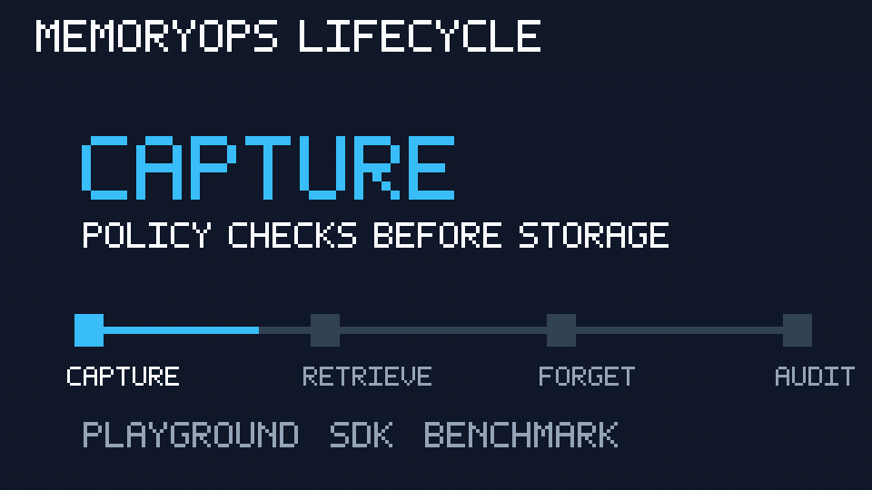
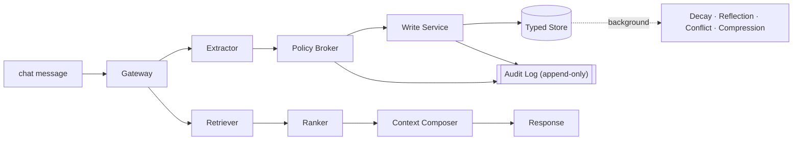

# MemoryOps AI

**MemoryOps AI is an open-source governed memory runtime for production AI assistants.**

It controls **what becomes memory, what enters context, what must be forgotten, what
influenced an answer, and what evidence proves each decision** — treating memory as
governed state, not just a vector database.

[](https://github.com/patibandlavenkatamanideep/memoryops-ai/actions/workflows/ci.yml)
&nbsp;[](https://github.com/patibandlavenkatamanideep/memoryops-ai/actions/workflows/benchmark.yml)
&nbsp;
&nbsp;
&nbsp;
&nbsp;

> **Two version tracks:** the **platform release** (`v2.2`, the feature milestone of
> the whole repo) is separate from the **public API + SDK contract** (`1.x`, the
> additive-compatibility promise). v2.2 ships the 1.0.0 contract — see
> [docs/api-stability.md](docs/api-stability.md#two-version-tracks).

## Live demo

**[memoryops-ai-production.up.railway.app](https://memoryops-ai-production.up.railway.app)**

Try the MemoryOps Playground — an interactive, demo-safe governed memory runtime
that runs the real MemoryOps pipeline in-process with ephemeral session state.



> **v2.2 (current).** The public HTTP API and Python SDK are stable under a `1.x`
> additive-compatibility promise ([docs/api-stability.md](docs/api-stability.md)).
> See the [CHANGELOG](CHANGELOG.md), [production-readiness](docs/production-readiness.md),
> [known limitations](docs/limitations.md), and the
> [design decisions](docs/design-decisions.md) (the hard calls + rejected alternatives).

## Current capabilities (all shipped)

| Version | Capability | What it gives you |
| --- | --- | --- |
| **v1.3** | Context Admission Gate + Memory Usage Trace | a memory enters context only if relevant **and** allowed; every answer carries an explainable trail |
| **v1.4** | Deletion Proof Layer | tombstone lineage — deletion propagates to derived artifacts |
| **v1.5** | Deleted-Memory Leakage Evals | prove deleted/expired memory can't leak (direct/indirect/cross-session/summary/reindex) |
| **v1.6** | Auth + Authorization Adapters | verify identity (JWT / trusted header) + tenant/user scope enforcement |
| **v1.7** | Vector Backend Abstraction | swap Postgres/pgvector · in-memory · Qdrant · LanceDB · Weaviate without weakening governance |
| **v1.8** | Full Observability | distributed tracing (+ optional OpenTelemetry), correlation IDs, `GET /api/traces` |
| **v1.9** | Recall Gate + Output Gate | audience-aware entry + post-generation disclosure control |
| **v2.0** | Enterprise Evidence Layer | tamper-evident audit chain + evidence bundles / deletion proofs |
| **v2.1** | Agent Framework Integrations | LangGraph · LlamaIndex · CrewAI · AutoGen · Semantic Kernel · OpenAI Agents SDK |
| **v2.2** | Public Benchmark + Regulated Demos | reproducible governance scorecard + healthcare/legal/finance demos |

## Adapter support level

Honest about what is exercised where. "Fully tested in CI" means the full
application test suite, eval harness, and governance benchmark run against a real
service in CI (the `api-postgres` job, which also proves FORCEd row-level security
with a non-superuser role); "contract-tested" means the adapter conforms to a
written contract (`assert_vector_index_contract`) but a live server isn't a CI
dependency; "example integration" is import-guarded illustrative glue.

| Adapter | Support level |
| --- | --- |
| Postgres + pgvector | **fully tested in CI** (suite + evals + benchmark + enforced RLS) |
| In-memory | **fully tested in CI** (default backend for the app + eval suites) |
| Qdrant | contract-tested, optional dependency |
| LanceDB | contract-tested, optional dependency |
| Weaviate | contract-tested, optional dependency |
| LangGraph / LlamaIndex / CrewAI / AutoGen / Semantic Kernel / OpenAI Agents SDK | example integrations, import-guarded, not live-service tested in CI |

Full detail (pip extras, env, live-validation): **[docs/adapters/](docs/adapters/README.md)**.
New to integrating? Start with the **[LangGraph tutorial](docs/tutorials/langgraph.md)**.

## Try MemoryOps

The shortest developer path is: run the governed API locally, install the public
SDK from PyPI, then make one scoped chat call that captures and later uses memory.

Terminal 1:

```bash
cd services/api
python3 -m venv .venv
source .venv/bin/activate
pip install -r requirements.txt
MEMORYOPS_STORAGE=memory uvicorn app.main:app --port 8000
```

Terminal 2:

```bash
python3 -m venv /tmp/memoryops-try
source /tmp/memoryops-try/bin/activate
pip install memoryops-sdk
python3 - <<'PY'
from memoryops import MemoryOpsClient

with MemoryOpsClient("http://127.0.0.1:8000", "demo_tenant", "demo_user") as mo:
    mo.chat("Remember that I prefer metric units.")
    reply = mo.chat("Which units should I use for distances?")
    print(reply.assistant_message)
    print([m.content for m in reply.used_memories])
PY
```

## Benchmark

MemoryOps **measures** governance rather than claiming it. `python benchmark/run_benchmark.py`
scores the eval harness into named suites; the two critical suites (deletion/leakage +
tenant isolation) must be perfect or the benchmark fails. Current scorecard
([benchmark/SCORECARD.md](benchmark/SCORECARD.md)) — **50/50 (100%), critical suites perfect ✅**:

| Suite | Pass rate |
| --- | --- |
| deletion_and_leakage ★ | 100% (12/12) |
| tenant_isolation ★ | 100% (17/17) |
| context_admission | 100% (2/2) |
| policy_governance | 100% (15/15) |
| retrieval_quality | 100% (4/4) |

★ critical — must be 100%. Reproducible + offline (no API keys); the same suites
also run against real Postgres + pgvector in CI (the `api-postgres` job).
The live badge at the top of this README is powered by
`.github/workflows/benchmark.yml`; run the same check locally with
`python benchmark/run_benchmark.py`. If it fails, start with the critical suite
reported in the scorecard, regenerate [benchmark/SCORECARD.md](benchmark/SCORECARD.md)
with `python benchmark/run_benchmark.py --md benchmark/SCORECARD.md`, and keep
deletion/leakage plus tenant isolation at 100%.

---

## Why this exists

Most AI "memory" demos do this:

```text
chat message → vector database → retrieve later
```

MemoryOps AI does this:

```text
WRITE PATH
Message → Extractor → Evaluator / Policy Broker → Write Service → Typed Memory Stores → Audit Log

READ PATH
Message → Retriever → Ranker → Context Composer → Response LLM

BACKGROUND
Decay Job → Reflection Agent → Conflict Resolver → Compression Worker

CROSS-CUTTING PLANES
Security · Governance · Observability · Evaluation · Reliability
```

The five verbs the system must demonstrate:

```text
Capture → Store → Retrieve → Update → Forget   (Governance wraps all five)
```



More diagrams (system architecture, lifecycle state machine, request sequence) are
in [docs/architecture.md](docs/architecture.md#diagrams).

---

## Enterprise invariants

These are non-negotiable and are enforced in code and tests.

1. **Tenant isolation** — User A's memory is never returned to User B or another tenant.
2. **Deletion guarantee** — Deleted memories are never retrieved again.
3. **Provenance** — Every stored memory traces back to its source message/document/manual input.
4. **Graceful degradation** — Retrieval failure never blocks response generation.
5. **Policy-before-storage** — Unsafe / secret-like content is filtered before it reaches the store.
6. **Temporary chat** — Temporary sessions never write or retrieve memory.
7. **Auditability** — Every memory lifecycle event produces an append-only audit event.
8. **Explainability** — The system can show which memories affected a response.
9. **Typed memory** — Episodic, semantic, procedural, project, knowledge, system memories differ.
10. **Evaluation** — Memory quality is testable through a golden set, not just manual inspection.

See [docs/architecture.md](docs/architecture.md) for the full design and where each invariant is
enforced.

---

## Repository layout

```text
memoryops-ai/
  apps/web/            Next.js frontend (chat, memories, governance, audit, loops, admin, architecture)
  apps/results-dashboard/ Public read-only Streamlit results/evidence dashboard (demo-only; v0.9)
  apps/playground/     Interactive Streamlit playground over the real pipeline (demo-only, in-memory; v0.12)
  services/api/        FastAPI backend (gateway, extractor, policy broker, write/read path, audit)
  services/worker/     Background jobs (decay, reflection, conflict resolution, compression)
  packages/memoryops-sdk/ Python SDK 1.0.0 + integration examples (quickstart, FastAPI, RAG, agent)
  packages/shared/     Shared types
  infra/db/            Postgres + pgvector migrations and seed
  infra/adr/           Architecture Decision Records
  infra/observability/ OpenTelemetry / metrics notes
  evals/               Golden + adversarial cases and the eval runner
  docs/                architecture, security, governance, rollout, demo-script
  docker-compose.yml
```

---

## Quickstart

### Option A — API only, no infra (fastest)

The API ships with an in-memory repository so you can run the write path and tests without Postgres.

```bash
cd services/api
python -m venv .venv && source .venv/bin/activate
pip install -r requirements.txt
export MEMORYOPS_STORAGE=memory          # default; uses in-memory store
uvicorn app.main:app --reload --port 8000
# open http://localhost:8000/docs
```

Run the invariant test suite:

```bash
cd services/api
pip install -r requirements-dev.txt
pytest -q
```

Run the eval harness against a running API (or in-process):

```bash
cd evals
python run_evals.py
```

### Option B — Full stack with Docker Compose

```bash
cp .env.example .env
docker compose up --build
# web  → http://localhost:3000
# api  → http://localhost:8000/docs
# db   → localhost:5432 (postgres/pgvector)
# redis→ localhost:6379
```

Compose runs migrations from `infra/db/migrations` on first boot and sets
`MEMORYOPS_STORAGE=postgres` for the API.

### Embeddings

Retrieval uses a swappable embedding provider. The default is a deterministic,
offline stub — no API key required — so tests and demos are reproducible.

```bash
export MEMORYOPS_EMBEDDING_PROVIDER=stub     # default; deterministic, no key
# optional real embeddings:
export MEMORYOPS_EMBEDDING_PROVIDER=openai
export OPENAI_API_KEY=sk-...
export OPENAI_EMBEDDING_MODEL=text-embedding-3-small
```

An unconfigured or failing provider degrades to the stub, and a query-embedding
failure degrades retrieval to keyword-only (`retrieval_mode="fallback"`).

### LLM provider adapters

Extraction and conflict detection run through a provider-neutral LLM layer
(`app/llm/`). The default is a deterministic, offline stub — no API key — so
behavior is reproducible and tests never touch the network. Optional OpenAI,
Anthropic, and Gemini adapters are used only when their key is set.

```bash
export MEMORYOPS_LLM_PROVIDER=stub          # default; deterministic, no key
# optional real providers (used only when the key is present):
export MEMORYOPS_LLM_PROVIDER=anthropic
export ANTHROPIC_API_KEY=...   ANTHROPIC_MODEL=claude-haiku-4-5-20251001
# also: openai (OPENAI_API_KEY/OPENAI_MODEL), gemini (GEMINI_API_KEY/GEMINI_MODEL)
export MEMORYOPS_LLM_FALLBACK_TO_HEURISTIC=true   # invalid JSON / failure → heuristic
```

LLM output is advisory: the deterministic policy broker runs after extraction and
stays authoritative — a model can never override policy, and secret-like content is
still blocked. See [docs/provider-llm-adapters.md](docs/provider-llm-adapters.md),
[docs/structured-memory-intelligence.md](docs/structured-memory-intelligence.md),
and [ADR-008](infra/adr/ADR-008-provider-llm-adapters.md).

Verify enforced Row-Level Security against a running Postgres:

```bash
python scripts/check_rls_policies.py        # SKIPs cleanly if no DB is reachable
```

### Frontend

```bash
cd apps/web
npm install
npm run dev          # http://localhost:3000
```

The frontend reads `NEXT_PUBLIC_API_URL` (defaults to `http://localhost:8000`).

---

## Deployment — Railway only

MemoryOps deploys to Railway only. There is no Vercel path. One Railway project
(`memoryops-ai`) runs five services:

| Service | Role | Source |
|---------|------|--------|
| `memoryops-web` | Next.js frontend | `apps/web/Dockerfile` |
| `memoryops-api` | FastAPI backend | `services/api/Dockerfile` |
| `memoryops-worker` | Background loops | `services/worker/Dockerfile` |
| Railway Postgres | Store + pgvector | plugin |
| Railway Redis | Queue / cache | plugin |

Build/deploy is config-as-code under [`railway/`](railway/). Docs:

- [docs/deployment/railway.md](docs/deployment/railway.md) — topology, order, rollback
- [docs/deployment/railway-env.md](docs/deployment/railway-env.md) — env var matrix
- [docs/deployment/railway-smoke-test.md](docs/deployment/railway-smoke-test.md) — post-deploy checks

Post-deploy verification:

```bash
python scripts/railway_smoke_test.py \
  --api-url https://memoryops-api.up.railway.app \
  --web-url https://memoryops-web.up.railway.app
```

---

## Capabilities

The build history is in the [CHANGELOG](CHANGELOG.md). What the system does today:

### Governed write and read path

- Write path: Gateway → Extractor → Policy Broker → Write Service → typed memory
  store → audit. The heuristic extractor and policy broker work with no API keys;
  LLM adapters are optional enhancements.
- Typed memory classification with importance / confidence / sensitivity scoring and
  provenance capture on every memory.
- Policy decisions — `SAVE`, `PENDING_APPROVAL`, `BLOCK`, `DROP_LOW_UTILITY`,
  `UPDATE_EXISTING`, `MERGE_WITH_EXISTING` — with secret / PII detection that blocks
  API keys and credentials before storage.
- Append-only audit log for every lifecycle event; temporary chat short-circuits
  both read and write.

### Retrieval, ranking, and storage

- Swappable embedding provider (`app/embeddings/`): deterministic offline stub plus
  optional OpenAI.
- Hybrid retrieval — pgvector cosine (`search_candidates`) blended with keyword
  overlap by the ranker, with a per-memory `score_breakdown` and a response
  `retrieval_mode` (`hybrid` / `fallback` / `none`).
- Enforced Postgres Row-Level Security (migration `004`, `FORCE` + tenant policy +
  session GUC), verified by `scripts/check_rls_policies.py`.

### LLM intelligence layer

- Provider-neutral LLM layer (`app/llm/`): deterministic `StubProvider` default plus
  optional OpenAI / Anthropic / Gemini adapters selected by `MEMORYOPS_LLM_PROVIDER`.
- Schema-validated structured extraction and conflict detection with a prompt
  registry and deterministic heuristic fallback. Invalid JSON, provider failure, or
  timeout degrades to the heuristic and never blocks chat; LLM output cannot override
  the policy broker. See [ADR-008](infra/adr/ADR-008-provider-llm-adapters.md).

### Governance control plane

- Browser control plane over the governed lifecycle: `/memories` (filterable
  inventory), `/memories/[id]` (detail + provenance + per-memory audit timeline +
  inline edit), `/governance` (approval queue + recorded policy decisions), and
  `/audit` (tenant-wide append-only history).
- Additive read routes (`GET /api/memories/{id}`, `/{id}/provenance`, `/{id}/audit`,
  plus a `memory_id` filter on `/api/audit`). The deletion guarantee holds in the UI:
  deleted memories are never listed or shown as active. See
  [docs/governance-ui.md](docs/governance-ui.md),
  [docs/memory-control-plane.md](docs/memory-control-plane.md), and
  [ADR-009](infra/adr/ADR-009-memory-control-plane.md).

### Background lifecycle workers

- Workers (`services/api/app/workers/`) maintain memory after capture, off the chat
  request path: decay, archive, conflict scan, deletion verification, deletion
  compaction, retention, and proposal-only reflection (retention and reflection off
  by default). A tenant-scoped runner drives them:
  `python -m app.workers.runner --tenant t1 --user u1 --job all`.
- Deletion compaction (v0.7) clears a soft-deleted memory's content, normalized
  content, vector material, and provenance excerpt after a retention window, while
  preserving the governance tombstone and audit trail. The purge is verified
  fail-closed. This is auditable content/vector compaction and retrieval-exclusion
  verification — not crypto-shred, and no physical disk/page erasure claim.
- Worker runtime (v0.8) makes the jobs operable: leases prevent duplicate concurrent
  runs, retry/backoff absorbs transient faults, exhausted retries become dead-letter
  records, and every run is persisted as content-free history. Worker health is at
  `GET /healthz/workers` (migration `006`).
- See [docs/background-lifecycle-workers.md](docs/background-lifecycle-workers.md),
  [docs/deletion-compaction.md](docs/deletion-compaction.md),
  [docs/worker-runtime.md](docs/worker-runtime.md), and ADRs
  [010](infra/adr/ADR-010-background-memory-lifecycle-workers.md),
  [011](infra/adr/ADR-011-physical-deletion-compaction-vector-purge.md),
  [012](infra/adr/ADR-012-worker-runtime-orchestration.md).

### Retention, legal hold, and consent

- Retention policy packs (sensitivity tier → retention window: `default` / `strict` /
  `extended`) drive a retention worker that soft-deletes expired or consent-revoked
  memory before the deletion-verification and compaction pipeline takes over. Off by
  default; a disabled or dry run records a decision preview without deleting.
- Legal hold is a fail-closed override that blocks all forgetting and the API delete
  route (`DELETE` → HTTP 409). It is a preservation control, not crypto-shred.
- Consent-aware memory records consent state (`granted` / `withdrawn` / `expired` /
  `not_required`); withdrawn or expired consent makes memory eligible for deletion.
  Governance state is metadata-driven (migration `007`) and audited; the admin surface
  is `/api/retention/*`. See [docs/retention-policies.md](docs/retention-policies.md)
  and [ADR-013](infra/adr/ADR-013-retention-legal-hold-consent.md).

### Loop engineering

MemoryOps models memory as governed loops rather than a passive store. The six core
loops — Memory Write, Memory Read, Governance, Evaluation, Release Gate, and
Continuous Learning — each have explicit states, policy gates, audit events, fallback
behavior, and evidence requirements. Loop definitions live in
`services/api/app/loops/`, runs and events are exposed through `/api/loops`, and the
frontend includes a Loops page. See [docs/loop-engineering.md](docs/loop-engineering.md),
[docs/loop-contracts.md](docs/loop-contracts.md), and
[docs/release-loop.md](docs/release-loop.md).

### Token compression (optional)

An optional [Headroom](https://github.com/chopratejas/headroom)-powered context
compression layer runs after policy checks, governance filtering, and context
composition, and only on the composed context block — never the raw user message and
never before the policy broker. It is off by default and not a dependency; any
compression failure degrades safely to the uncompressed context.

```bash
pip install "headroom-ai[all]"            # optional
export MEMORYOPS_CONTEXT_COMPRESSION=headroom   # default: none
```

Each chat response carries a `compression` block with estimated tokens saved and the
compression ratio. See [docs/token-compression.md](docs/token-compression.md),
[docs/integrations/headroom.md](docs/integrations/headroom.md), and
[ADR-007](infra/adr/ADR-007-headroom-token-compression.md).

### SDK, dashboard, and playground

- A typed [Python SDK](packages/memoryops-sdk) wraps the governed HTTP API (chat,
  memories, retention / legal-hold / consent, audit, metrics, loops, health) and
  injects the tenant/user scope on every call. The server stays authoritative for all
  governance — the SDK adds none. Runnable integration examples cover a quickstart, a
  FastAPI assistant endpoint, a RAG assistant, and an agent-memory tool. See
  [docs/assistant-sdk.md](docs/assistant-sdk.md) and
  [ADR-014](infra/adr/ADR-014-assistant-sdk.md).
- The read-only [results dashboard](apps/results-dashboard) (Streamlit) is the static
  evidence view: version timeline, memory lifecycle, deletion-compaction proof, worker
  runtime results, audit evidence, validation results, and honest limitations. See
  [docs/results-dashboard.md](docs/results-dashboard.md).
- The interactive [playground](apps/playground) drives the real governed pipeline
  in-process against a fresh in-memory store per session — capture, ask a question
  that uses memory, apply a legal hold / withdraw consent / delete / run the lifecycle
  workers, and watch the audit trace and assistant behavior change live. No database,
  auth, secrets, or network. See [docs/playground.md](docs/playground.md) and the
  [live demo](https://memoryops-ai-production.up.railway.app).

---

## Status and roadmap

v1.0 is the stable, production-ready governed memory runtime. The public HTTP API and
Python SDK are declared stable under a `1.x` additive-compatibility promise
([docs/api-stability.md](docs/api-stability.md)); package versions are `1.0.0`.
Release-readiness is documented in [known limitations](docs/limitations.md), the
[production-readiness map](docs/production-readiness.md), and the
[CHANGELOG](CHANGELOG.md).

Shipped since v1.0: deletion proof layer + tombstone lineage (v1.4), deleted-memory
leakage evals (v1.5), auth + authorization adapters (v1.6), storage/vector backend
abstraction (v1.7), full observability / distributed tracing (v1.8), Recall Gate +
Output Gate (v1.9), the Enterprise Evidence Layer — tamper-evident audit + evidence
reports (v2.0), agent framework integrations (v2.1), and a public memory-governance
benchmark (v2.2). See the [CHANGELOG](CHANGELOG.md).

Planned next:

- Consent capture at the UI/SDK edge; cross-tenant retention scheduling.
- Hard purge / crypto-shred and pgvector index reclamation (beyond v0.7's auditable
  compaction).
- Optional queue/cron backend behind the orchestrator interface; auto-discovered scope
  enumeration.
- External audit-chain notarization; semantic (LLM-judge) Output Gate; published
  per-framework integration packages and a hosted benchmark leaderboard.

See [docs/rollout.md](docs/rollout.md) and the build phases in [CLAUDE.md](CLAUDE.md).

---

## Agentic engineering layer

MemoryOps AI includes an agentic engineering layer around the core memory system,
never on the chat request path. It draws on three systems:

1. **Hermes Agent** — an operator/developer assistant layer for release checks,
   invariant audits, and guided project workflows. See [`.hermes/skills/`](.hermes/skills/)
   and [docs/integrations/hermes-agent.md](docs/integrations/hermes-agent.md).
2. **agentic-swe-kit** — a phase-gate framework for production engineering, covering
   cognitive design, memory architecture, evaluation, observability, security,
   reliability, governance, CI/CD for AI, and continuous learning. See
   [docs/agentic-swe-kit-map.md](docs/agentic-swe-kit-map.md) and
   [docs/phase-gates/](docs/phase-gates/).
3. **AI PR Review Agent** — the pattern behind the PR Invariant Evidence Gate. Every
   PR that touches memory, policy, retrieval, deletion, security, migrations, or API
   contracts must provide evidence (tests / evals / docs / ADRs). See
   [scripts/pr_invariant_gate.py](scripts/pr_invariant_gate.py),
   [.github/workflows/pr-invariant-evidence-gate.yml](.github/workflows/pr-invariant-evidence-gate.yml),
   and [docs/ai-pr-review-policy.md](docs/ai-pr-review-policy.md).

Overview: [docs/integrations/README.md](docs/integrations/README.md).

## Documentation

- [CHANGELOG.md](CHANGELOG.md) — release notes, v0.1 → v1.0.
- [docs/api-stability.md](docs/api-stability.md) — stable v1 API + SDK surface, semver + deprecation policy.
- [docs/production-readiness.md](docs/production-readiness.md) — invariants/planes → where enforced; production-capable vs demo-only.
- [docs/limitations.md](docs/limitations.md) — the consolidated, authoritative list of what MemoryOps does **not** claim.
- [docs/architecture.md](docs/architecture.md) — write path, read path, planes, invariants.
- [docs/loop-engineering.md](docs/loop-engineering.md) — loop definitions, states, gates, evidence.
- [docs/loop-contracts.md](docs/loop-contracts.md) — LoopDefinition, LoopRun, LoopEvent contracts.
- [docs/security.md](docs/security.md) — tenant isolation, secret detection, deletion guarantee.
- [docs/governance.md](docs/governance.md) — lifecycle, approvals, audit, retention.
- [docs/rollout.md](docs/rollout.md) — phased delivery and production roadmap.
- [docs/results-dashboard.md](docs/results-dashboard.md) — public read-only results/evidence dashboard (v0.9; demo-only, not production UI).
- [docs/playground.md](docs/playground.md) — interactive public playground + hosted demo (v0.12; demo-only, in-memory, not production UI).
- [docs/assistant-sdk.md](docs/assistant-sdk.md) — Python SDK 1.0.0 + integration examples.
- [docs/demo-script.md](docs/demo-script.md) — the 6-step demo.
- [infra/adr/](infra/adr/) — storage, retrieval, policy broker, observability, deletion ADRs.
