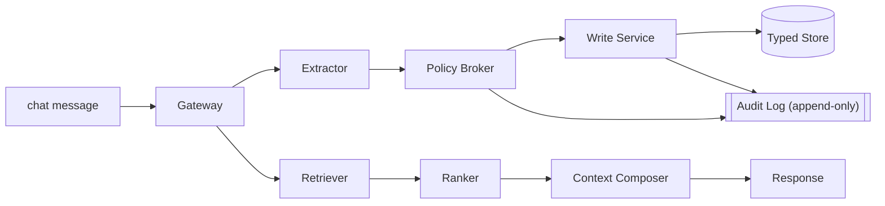

# MemoryOps AI

**An open-source governed memory runtime for production AI assistants.**

It controls **what becomes memory, what enters context, what must be forgotten, what
influenced an answer, and what evidence proves each decision** — treating memory as
governed state, not just a vector database.

[](https://github.com/patibandlavenkatamanideep/memoryops-ai/actions/workflows/ci.yml)
&nbsp;[](https://github.com/patibandlavenkatamanideep/memoryops-ai/actions/workflows/benchmark.yml)
&nbsp;[](https://pypi.org/project/memoryops-sdk/)
&nbsp;
&nbsp;
&nbsp;

> **Two version tracks:** the **platform release** (`v2.2`, the repo's feature
> milestone) is separate from the **public API + SDK contract** (`1.x`, an additive-
> compatibility promise). See [docs/api-stability.md](docs/api-stability.md#two-version-tracks).

## Live demo

**[memoryops-ai-production.up.railway.app](https://memoryops-ai-production.up.railway.app)** —
the Playground runs the real governed pipeline in-process with ephemeral session state.


## Try it in 30 seconds

Install the published SDK, point it at a running API, and make one scoped call that
captures and later uses memory:

```bash
# Terminal 1 — the governed API (in-memory store, no infra, no keys)
cd services/api && python3 -m venv .venv && source .venv/bin/activate
pip install -r requirements.txt
MEMORYOPS_STORAGE=memory uvicorn app.main:app --port 8000
```

```bash
# Terminal 2 — the SDK from PyPI
pip install memoryops-sdk
python3 - <<'PY'
from memoryops import MemoryOpsClient
with MemoryOpsClient("http://127.0.0.1:8000", "demo_tenant", "demo_user") as mo:
    mo.chat("Remember that I prefer metric units.")
    reply = mo.chat("Which units should I use for distances?")
    print(reply.assistant_message)
    print([m.content for m in reply.used_memories])
PY
```

Full setup (Docker Compose, Postgres/pgvector, embeddings, LLM adapters, frontend):
**[docs/quickstart.md](docs/quickstart.md)**. SDK details: **[docs/assistant-sdk.md](docs/assistant-sdk.md)**.

## Why this exists

Most AI "memory" is `message → vector DB → retrieve later`. MemoryOps adds the
governance that production needs:

```text
WRITE  Message → Extractor → Policy Broker → Write Service → Typed Store → Audit Log
READ   Message → Retriever → Ranker → Context Composer → Response
BACKGROUND  Decay · Reflection · Conflict · Compression
PLANES      Security · Governance · Observability · Evaluation · Reliability
```



Full design, diagrams, and where each invariant is enforced:
**[docs/architecture.md](docs/architecture.md)**.

## Enterprise invariants (enforced in code + tests)

1. **Tenant isolation** — one user's memory is never returned to another user/tenant.
2. **Deletion guarantee** — deleted memories are never retrieved again.
3. **Provenance** — every memory traces back to its source.
4. **Graceful degradation** — retrieval failure never blocks a response.
5. **Policy-before-storage** — unsafe/secret-like content is filtered before storage.
6. **Temporary chat** — temporary sessions never read or write memory.
7. **Auditability** — every lifecycle mutation and its audit event commit together in
   one transaction (atomic under partial failure), as an append-only, tamper-evident chain.
8. **Explainability** — the system can show which memories affected a response.
9. **Typed memory** — episodic/semantic/procedural/project/knowledge/system differ.
10. **Evaluation** — memory quality is testable via a golden set, not manual inspection.

## Benchmark — governance is measured, not claimed

`python benchmark/run_benchmark.py` scores the eval harness into named suites; the two
**critical** suites (deletion/leakage + tenant isolation) must be perfect or it fails.
Reproducible and offline (no keys); the same suites also run against real
Postgres + pgvector in CI (the `api-postgres` job). Current
[scorecard](benchmark/SCORECARD.md) — **50/50 (100%), critical suites perfect ✅**:

| Suite | Pass rate | | Suite | Pass rate |
| --- | --- | --- | --- | --- |
| deletion_and_leakage ★ | 12/12 | | policy_governance | 15/15 |
| tenant_isolation ★ | 17/17 | | retrieval_quality | 4/4 |
| context_admission | 2/2 | | ★ critical (must be 100%) | |

## What's shipped

All capabilities v1.3 → v2.2 are shipped: Context Admission Gate + Memory Usage Trace,
deletion-proof tombstone lineage, deleted-memory leakage evals, auth/authorization
adapters (JWT/JWKS + trusted header), vector-backend abstraction (Postgres/pgvector ·
in-memory · Qdrant · LanceDB · Weaviate), distributed tracing + Prometheus metrics,
Recall/Output gates, the Enterprise Evidence Layer (tamper-evident audit + evidence
bundles), agent-framework integrations, and a public governance benchmark. Details in
the **[CHANGELOG](CHANGELOG.md)** and **[docs/architecture.md](docs/architecture.md)**.

**Adapter honesty:** Postgres/pgvector and in-memory are *fully tested in CI* (suite +
evals + benchmark + enforced RLS). Qdrant/LanceDB/Weaviate are *contract-tested*.
Framework integrations (LangGraph · LlamaIndex · CrewAI · AutoGen · Semantic Kernel ·
OpenAI Agents SDK) are *import-guarded examples*, not live-service tested. See
**[docs/adapters/](docs/adapters/README.md)**.

## Known gaps (what MemoryOps does *not* yet claim)

Kept explicit on purpose — see **[docs/limitations.md](docs/limitations.md)** for the
authoritative list. The material ones:

- **Real-model extraction quality is measured, but on a small set.** A live run on a
  25-turn labeled set with **gemini-2.5-flash** scores **0.94 precision / 0.94 recall /
  0.94 F1 with zero fallbacks** (vs. the offline stub's 1.00 / 0.53 / 0.69), recorded in
  [EXTRACTION_QUALITY.md](benchmark/EXTRACTION_QUALITY.md). Broader provider/model
  coverage and larger datasets remain future work — add a key and more rows fill in:
  `python evals/run_extraction_quality.py --provider openai` (needs `OPENAI_API_KEY`).
- **The request path is synchronous.** Under load, throughput is flat and latency grows
  with concurrency in a single process ([docs/performance.md](docs/performance.md)); the
  cause is not yet isolated, and the async decision is deferred until the I/O-bound
  measurement (real provider + Postgres) exists.
- **No external baseline** in the benchmark yet, and **no crypto-shred / physical
  erasure** (deletion compaction is auditable content/vector clearing + tombstone).

## Deployment

Railway only (no Vercel): one project, five services (web · api · worker · Postgres ·
Redis). See **[docs/deployment/railway.md](docs/deployment/railway.md)**.

## Documentation

- [docs/quickstart.md](docs/quickstart.md) — full local setup (Docker, Postgres, embeddings, LLM adapters, frontend).
- [docs/architecture.md](docs/architecture.md) — write/read paths, planes, invariants, diagrams.
- [docs/api-stability.md](docs/api-stability.md) — the stable `1.x` API + SDK surface and deprecation policy.
- [docs/production-readiness.md](docs/production-readiness.md) — invariants/planes → where enforced; production vs demo.
- [docs/limitations.md](docs/limitations.md) — the authoritative list of what MemoryOps does **not** claim.
- [docs/security.md](docs/security.md) · [docs/governance.md](docs/governance.md) — trust boundaries, lifecycle, approvals, audit.
- [docs/assistant-sdk.md](docs/assistant-sdk.md) — the Python SDK + integration examples.
- [docs/design-decisions.md](docs/design-decisions.md) — the hard calls and rejected alternatives.
- [CHANGELOG.md](CHANGELOG.md) · [infra/adr/](infra/adr/) — release history and Architecture Decision Records.

The **agentic engineering layer** (Hermes operator skills, agentic-swe-kit phase gates,
the PR Invariant Evidence Gate) wraps the core and is never on the chat request path —
see [docs/integrations/README.md](docs/integrations/README.md).
