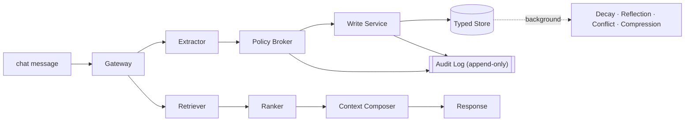

# MemoryOps AI

MemoryOps AI is an enterprise-shaped, loop-engineered memory governance layer for AI assistants.
It implements a ChatGPT-style memory lifecycle with capture, policy evaluation, typed storage,
hybrid retrieval, controlled forgetting, auditability, and tenant isolation.

Most demos treat memory as a vector database. MemoryOps AI treats memory as **governed state**.

> **Tagline:** Enterprise memory governance for AI assistants.
> **Core claim:** Memory is not a database. Memory is a governed decision system that decides what
> information is valuable enough to carry into the future.

---

## Why this exists

Most AI "memory" demos do this:

```text
chat message → vector database → retrieve later
```

MemoryOps AI does this:

```text
WRITE PATH
Message → Extractor → Evaluator / Policy Broker → Write Service → Typed Memory Stores → Audit Log

READ PATH
Message → Retriever → Ranker → Context Composer → Response LLM

BACKGROUND
Decay Job → Reflection Agent → Conflict Resolver → Compression Worker

CROSS-CUTTING PLANES
Security · Governance · Observability · Evaluation · Reliability
```

The five verbs the system must demonstrate:

```text
Capture → Store → Retrieve → Update → Forget   (Governance wraps all five)
```



More diagrams (system architecture, lifecycle state machine, request sequence) are
in [docs/architecture.md](docs/architecture.md#diagrams).

---

## Enterprise invariants

These are non-negotiable and are enforced in code and tests.

1. **Tenant isolation** — User A's memory is never returned to User B or another tenant.
2. **Deletion guarantee** — Deleted memories are never retrieved again.
3. **Provenance** — Every stored memory traces back to its source message/document/manual input.
4. **Graceful degradation** — Retrieval failure never blocks response generation.
5. **Policy-before-storage** — Unsafe / secret-like content is filtered before it reaches the store.
6. **Temporary chat** — Temporary sessions never write or retrieve memory.
7. **Auditability** — Every memory lifecycle event produces an append-only audit event.
8. **Explainability** — The system can show which memories affected a response.
9. **Typed memory** — Episodic, semantic, procedural, project, knowledge, system memories differ.
10. **Evaluation** — Memory quality is testable through a golden set, not just manual inspection.

See [docs/architecture.md](docs/architecture.md) for the full design and where each invariant is
enforced.

---

## Repository layout

```text
memoryops-ai/
  apps/web/            Next.js frontend (chat, memory dashboard, admin, architecture)
  services/api/        FastAPI backend (gateway, extractor, policy broker, write/read path, audit)
  services/worker/     Background jobs (decay, reflection, conflict resolution, compression)
  packages/shared/     Shared types
  infra/db/            Postgres + pgvector migrations and seed
  infra/adr/           Architecture Decision Records
  infra/observability/ OpenTelemetry / metrics notes
  evals/               Golden + adversarial cases and the eval runner
  docs/                architecture, security, governance, rollout, demo-script
  docker-compose.yml
```

---

## Quickstart

### Option A — API only, no infra (fastest)

The API ships with an in-memory repository so you can run the write path and tests without Postgres.

```bash
cd services/api
python -m venv .venv && source .venv/bin/activate
pip install -r requirements.txt
export MEMORYOPS_STORAGE=memory          # default; uses in-memory store
uvicorn app.main:app --reload --port 8000
# open http://localhost:8000/docs
```

Run the invariant test suite:

```bash
cd services/api
pip install -r requirements-dev.txt
pytest -q
```

Run the eval harness against a running API (or in-process):

```bash
cd evals
python run_evals.py
```

### Option B — Full stack with Docker Compose

```bash
cp .env.example .env
docker compose up --build
# web  → http://localhost:3000
# api  → http://localhost:8000/docs
# db   → localhost:5432 (postgres/pgvector)
# redis→ localhost:6379
```

Compose runs migrations from `infra/db/migrations` on first boot and sets
`MEMORYOPS_STORAGE=postgres` for the API.

### Embeddings (v0.3)

Retrieval uses a swappable embedding provider. The default is a deterministic,
offline **stub** — no API key required — so tests and demos are reproducible.

```bash
export MEMORYOPS_EMBEDDING_PROVIDER=stub     # default; deterministic, no key
# optional real embeddings:
export MEMORYOPS_EMBEDDING_PROVIDER=openai
export OPENAI_API_KEY=sk-...
export OPENAI_EMBEDDING_MODEL=text-embedding-3-small
```

An unconfigured or failing provider degrades to the stub, and a query-embedding
failure degrades retrieval to keyword-only (`retrieval_mode="fallback"`).

Verify enforced Row-Level Security against a running Postgres:

```bash
python scripts/check_rls_policies.py        # SKIPs cleanly if no DB is reachable
```

### Frontend

```bash
cd apps/web
npm install
npm run dev          # http://localhost:3000
```

The frontend reads `NEXT_PUBLIC_API_URL` (defaults to `http://localhost:8000`).

---

## Deployment — Railway only (v0.3.2)

MemoryOps deploys to **Railway only**. There is **no Vercel** path. One Railway
project (`memoryops-ai`) runs five services:

| Service | Role | Source |
|---------|------|--------|
| `memoryops-web` | Next.js frontend | `apps/web/Dockerfile` |
| `memoryops-api` | FastAPI backend | `services/api/Dockerfile` |
| `memoryops-worker` | Background loops | `services/worker/Dockerfile` |
| Railway Postgres | Store + pgvector | plugin |
| Railway Redis | Queue / cache | plugin |

Build/deploy is config-as-code under [`railway/`](railway/). Docs:

- [docs/deployment/railway.md](docs/deployment/railway.md) — topology, order, rollback
- [docs/deployment/railway-env.md](docs/deployment/railway-env.md) — env var matrix
- [docs/deployment/railway-smoke-test.md](docs/deployment/railway-smoke-test.md) — post-deploy checks

Post-deploy verification:

```bash
python scripts/railway_smoke_test.py \
  --api-url https://memoryops-api.up.railway.app \
  --web-url https://memoryops-web.up.railway.app
```

---

## What works today (Phase 0 + Phase 1)

- Full design spine: README, architecture/security/governance/rollout docs, 5 ADRs, DB schema.
- FastAPI write path: **Gateway → Extractor → Policy Broker → Write Service → Memory Store → Audit**.
- Heuristic extractor + policy broker (works with **no API keys**); pluggable LLM adapter interface.
- Typed memory classification, importance/confidence/sensitivity scoring, provenance capture.
- Policy decisions: `SAVE`, `PENDING_APPROVAL`, `BLOCK`, `DROP_LOW_UTILITY`, `UPDATE_EXISTING`, `MERGE_WITH_EXISTING`.
- Secret / PII detection blocks API keys and credentials before storage.
- Append-only audit log for every lifecycle event.
- Temporary chat short-circuits both read and write.
- Memory dashboard + admin/audit + architecture pages (frontend skeleton).
- Invariant test suite + eval harness scaffolding.

## Loop Engineering Layer (v0.3.1)

MemoryOps models memory as a set of governed loops rather than a passive store.

The core loops are:

1. Memory Write Loop
2. Memory Read Loop
3. Governance Loop
4. Evaluation Loop
5. Release Gate Loop
6. Continuous Learning Loop

Each loop has explicit states, policy gates, audit events, fallback behavior, and
evidence requirements. Loop definitions live in `services/api/app/loops/`, loop
runs/events are exposed through `/api/loops`, and the frontend includes a Loops page.

See [docs/loop-engineering.md](docs/loop-engineering.md),
[docs/loop-contracts.md](docs/loop-contracts.md), and
[docs/release-loop.md](docs/release-loop.md).

## Token Compression Layer (v0.2.1)

MemoryOps supports an optional [Headroom](https://github.com/chopratejas/headroom)-powered
context compression layer. Compression runs **after** policy checks, governance
filtering, and context composition, and **only** on the composed context block —
never the raw user message and never before the policy broker. It reduces tokens
sent to the LLM while preserving MemoryOps invariants (provenance, deletion
guarantee, tenant isolation, temporary-chat behavior, explainability metadata).

It is **off by default** and **not a dependency** — the app runs without
`headroom-ai` installed, and any compression failure degrades safely to the
uncompressed context.

```bash
pip install "headroom-ai[all]"            # optional
export MEMORYOPS_CONTEXT_COMPRESSION=headroom   # default: none
```

Each chat response carries a `compression` block with estimated tokens saved and
the compression ratio. See [docs/token-compression.md](docs/token-compression.md),
[docs/integrations/headroom.md](docs/integrations/headroom.md), and
[ADR-007](infra/adr/ADR-007-headroom-token-compression.md). Headroom is Apache-2.0;
MemoryOps integrates it via an adapter and does not vendor its source.

## What works as of v0.3 (real data layer)

- Swappable embedding provider (`app/embeddings/`): deterministic offline stub + optional OpenAI.
- **Hybrid retrieval**: pgvector cosine (`search_candidates`) + keyword overlap, blended by the ranker.
- Per-memory **`score_breakdown`** + response **`retrieval_mode`** (`hybrid` / `fallback` / `none`).
- **Enforced** Postgres Row-Level Security (migration `004`, `FORCE` + tenant policy + session GUC).
- Expanded evals (semantic / keyword / archived / score-breakdown) + new tests; RLS test is DB-guarded.

## What remains (v0.4+)

- v0.4: provider LLM adapters (OpenAI/Anthropic/Gemini) + structured extraction/evaluation.
- v0.5: governance UI actions (approve/edit/archive/delete) fully wired.
- v0.6: decay / reflection / conflict-resolution workers.
- v0.7+: observability + economics, AI PR review runtime, deployment hardening.

See [docs/rollout.md](docs/rollout.md) and the build phases in [CLAUDE.md](CLAUDE.md).

---

## Agentic Engineering Layer

MemoryOps AI includes an agentic engineering layer **around** the core memory
system (never on the chat request path). It is inspired by three systems:

1. **Hermes Agent** — used as an operator/developer assistant layer for release
   checks, invariant audits, and guided project workflows. See
   [`.hermes/skills/`](.hermes/skills/) and [docs/integrations/hermes-agent.md](docs/integrations/hermes-agent.md).
2. **agentic-swe-kit** — used as a phase-gate framework for production engineering.
   MemoryOps maps to lifecycle phases covering cognitive design, memory
   architecture, evaluation, observability, security, reliability, governance,
   CI/CD for AI, and continuous learning. See
   [docs/agentic-swe-kit-map.md](docs/agentic-swe-kit-map.md) and
   [docs/phase-gates/](docs/phase-gates/).
3. **AI PR Review Agent** — the pattern behind the **PR Invariant Evidence Gate**.
   Every PR that touches memory, policy, retrieval, deletion, security, migrations,
   or API contracts must provide evidence (tests / evals / docs / ADRs). See
   [scripts/pr_invariant_gate.py](scripts/pr_invariant_gate.py),
   [.github/workflows/pr-invariant-evidence-gate.yml](.github/workflows/pr-invariant-evidence-gate.yml),
   and [docs/ai-pr-review-policy.md](docs/ai-pr-review-policy.md).

The goal: MemoryOps is not just an AI memory feature — it is a governed engineering
system with release discipline, review gates, and operational safety. Overview:
[docs/integrations/README.md](docs/integrations/README.md).

## Documentation

- [docs/architecture.md](docs/architecture.md) — write path, read path, planes, invariants.
- [docs/loop-engineering.md](docs/loop-engineering.md) — loop definitions, states, gates, evidence.
- [docs/loop-contracts.md](docs/loop-contracts.md) — LoopDefinition, LoopRun, LoopEvent contracts.
- [docs/security.md](docs/security.md) — tenant isolation, secret detection, deletion guarantee.
- [docs/governance.md](docs/governance.md) — lifecycle, approvals, audit, retention.
- [docs/rollout.md](docs/rollout.md) — phased delivery and production roadmap.
- [docs/demo-script.md](docs/demo-script.md) — the 6-step demo.
- [infra/adr/](infra/adr/) — storage, retrieval, policy broker, observability, deletion ADRs.
