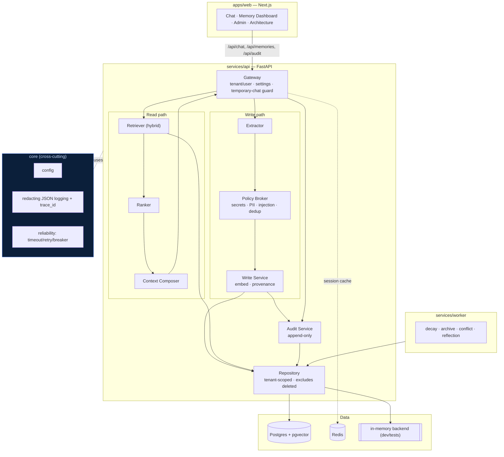
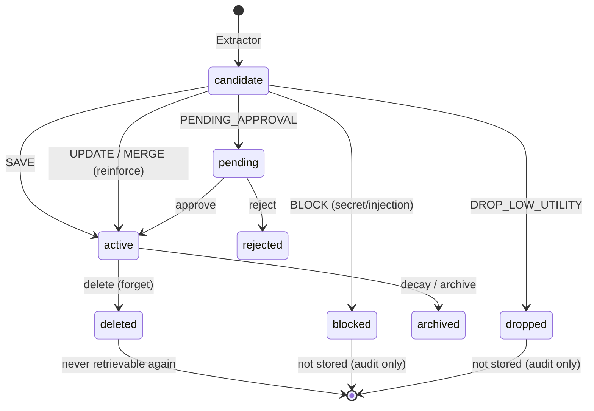
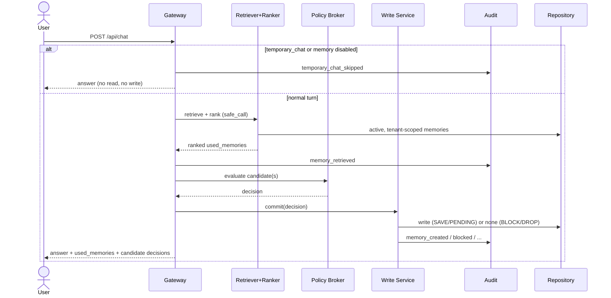
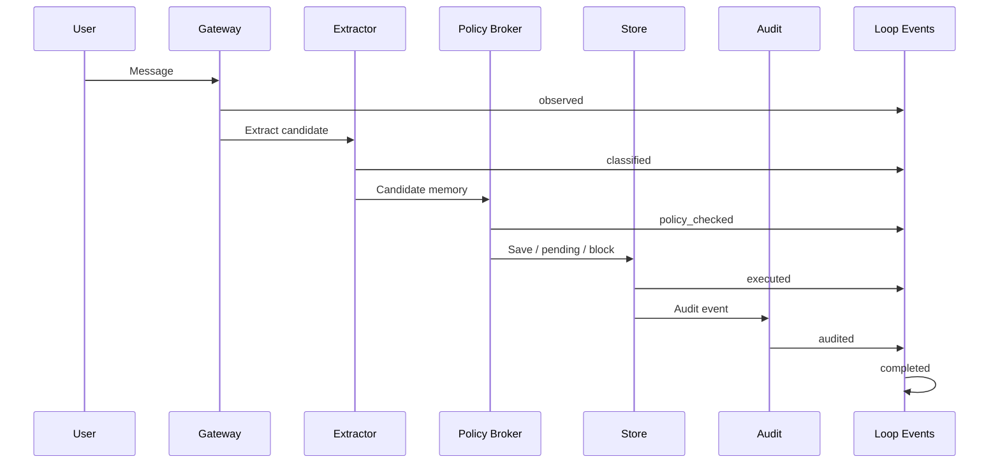
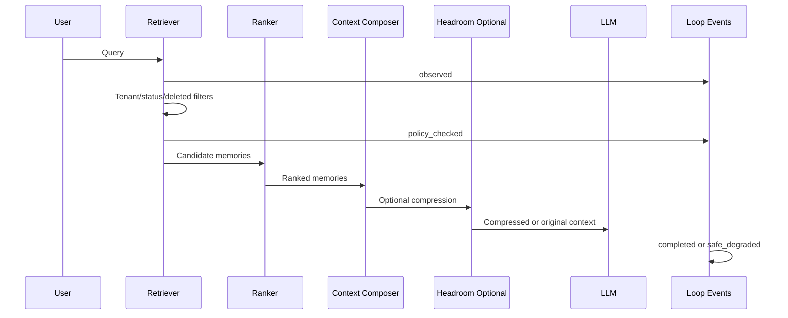

# Architecture — MemoryOps AI

MemoryOps AI is a **governed loop-engineered memory lifecycle system**. It treats memory not as a vector store but
as state that must be captured, evaluated, stored, retrieved, ranked, composed, updated, forgotten,
and audited — under five cross-cutting planes.

```text
                         ┌──────────────────────────────────────────────┐
                         │  PLANES: Security · Governance · Observability │
                         │          Reliability · Evaluation             │
                         └──────────────────────────────────────────────┘

 USER / GATEWAY
     │
     ├──────────────── WRITE PATH ─────────────────────────────────────────────┐
     │                                                                          │
     │  message ─▶ Extractor ─▶ Policy Broker ─▶ Write Service ─▶ Memory Store  │
     │              (candidates)   (decision)     (dedup/embed)    (typed)      │
     │                                  │                              │        │
     │                                  └────────────▶ Audit Log ◀─────┘        │
     │                                                                          │
     ├──────────────── READ PATH ──────────────────────────────────────────────┤
     │                                                                          │
     │  message ─▶ Retriever ─▶ Ranker ─▶ Context Composer ─▶ Response LLM      │
     │             (hybrid)      (score)    (compact block)     (answer)        │
     │                                                                          │
     └──────────────── BACKGROUND ─────────────────────────────────────────────┘
        Decay · Reflection · Conflict Resolution · Compression
```

## Diagrams

### System architecture



### Memory lifecycle (state machine)



### Chat request sequence



### Memory write loop



### Memory read loop



## Loop engineering layer (v0.3.1)

Loop engineering makes the major memory workflows explicit:

```text
Observe -> Decide -> Act -> Verify -> Audit -> Learn
```

The six primary loops are `memory.write`, `memory.read`, `memory.governance`,
`memory.evaluation`, `release.gate`, and `learning.continuous`. Definitions live
in `services/api/app/loops/registry.py`; transition rules live in
`services/api/app/loops/state_machine.py`; operational runs/events are stored via
the repository and exposed at `/api/loops`.

Loop events are separate from audit logs. Loop events answer where a workflow is
in its decision cycle; audit logs answer who did what, when, and why.

## Write path (Phase 1 — implemented)

1. **Gateway** ([services/api/app/services/gateway.py](../services/api/app/services/gateway.py))
   - Attaches `tenant_id` / `user_id`, loads `memory_settings`.
   - If `temporary_chat` is on or memory is disabled → **no read, no write** (invariant #6).
   - Orchestrates extractor → policy broker → write service and returns memory metadata.

2. **Extractor** ([extractor.py](../services/api/app/services/extractor.py))
   - Turns a conversation turn into zero or more candidate memories (JSON).
   - Classifies `memory_type`, assigns `confidence` + `importance`, preserves `source_excerpt`.
   - Heuristic by default (no API key needed); pluggable LLM adapter via `app/core/llm.py`.

3. **Policy Broker / Evaluator** ([policy_broker.py](../services/api/app/services/policy_broker.py))
   - Runs **before storage** (invariant #5).
   - Secret/PII detection (API keys, tokens, credentials) → `BLOCK`.
   - Sensitivity classification; sensitive + `require_approval_for_sensitive` → `PENDING_APPROVAL`.
   - Low-utility/duplicate → `DROP_LOW_UTILITY`; near-duplicate of existing → `UPDATE_EXISTING` /
     `MERGE_WITH_EXISTING`; otherwise `SAVE`.

4. **Write Service** ([write_service.py](../services/api/app/services/write_service.py))
   - Deduplicates, generates embedding (heuristic or provider), writes to the typed store with full
     provenance (invariant #3), appends an audit event (invariant #7).

5. **Memory Store** ([db/](../services/api/app/db/))
   - Repository abstraction. `memory` (in-process, for tests/demo) or `postgres` (pgvector).
   - All queries are tenant + user scoped (invariant #1) and exclude `deleted` (invariant #2).

6. **Audit Log** ([audit.py](../services/api/app/services/audit.py))
   - Append-only events for every lifecycle action.

## Read path (Phase 2 — v0.3: real embeddings + pgvector + hybrid)

- **Embeddings** — a swappable `EmbeddingProvider` (`app/embeddings/`). Default
  `StubEmbeddingProvider` is deterministic/offline (1536-dim, L2-normalized);
  `OpenAIEmbeddingProvider` activates only with `OPENAI_API_KEY` and degrades to
  the stub on failure. See [ADR-006](../infra/adr/ADR-006-pgvector-rls-retrieval.md).
- **Retriever** — hybrid: tenant+user-scoped vector candidates from the repository's
  `search_candidates` (real pgvector cosine on Postgres, in-Python cosine in memory)
  plus keyword overlap. Filters tenant/user/`status='active'`/`deleted_at is null` at
  the source; deleted + pending + wrong-tenant memories are excluded.
- **Ranker** — `0.35·vector_similarity + 0.20·keyword + 0.15·importance + 0.10·confidence +
  0.10·recency + 0.10·reinforcement`. Emits a per-memory `score_breakdown` of the raw
  component signals (explainability, invariant #8). *Changing this formula requires a
  docs/api-contracts.md or docs/architecture.md update — enforced by the PR gate.*
- **Context Composer** — compact context block with internal source IDs; never leaks hidden memory.
- **Context Compression (v0.2.1, optional)** — after composition and before the LLM, the
  composed *governed* context block may be compressed by an optional `ContextCompressor`
  (`MEMORYOPS_CONTEXT_COMPRESSION=headroom`). Default is a transparent no-op. It never runs
  before the policy broker and never touches the raw user message; failure degrades to the
  uncompressed block. See [ADR-007](../infra/adr/ADR-007-headroom-token-compression.md).
- **Graceful degradation** — query-embedding failure falls back to keyword-only ranking
  (`retrieval_mode="fallback"`); any retrieval failure is caught and the assistant still
  answers (#4).

## Background path (Phase 5 — scaffolded)

`services/worker` hosts decay (age out weights), reflection/compression (collapse repeats),
conflict resolution (reconcile contradictions), and system-learning memory generation.

## Deployment topology (Railway-only — v0.3.2)

MemoryOps deploys to a **single Railway project** (`memoryops-ai`) with five
services and Railway's private networking. There is **no Vercel** target.

| Service | Role | Source | Health |
|---------|------|--------|--------|
| `memoryops-web` | Next.js frontend | `apps/web/Dockerfile` | `GET /` |
| `memoryops-api` | FastAPI backend | `services/api/Dockerfile` | `/healthz`, `/readyz` |
| `memoryops-worker` | Background loops | `services/worker/Dockerfile` | process liveness |
| Railway Postgres | Store + pgvector | plugin | managed |
| Railway Redis | Queue / cache | plugin | managed |

Build/deploy settings are config-as-code under [`railway/`](../railway/). The API
binds `$PORT`; the web build inlines `NEXT_PUBLIC_API_URL` pointing at the API
service. Full topology, env matrix, and smoke test:
[docs/deployment/](deployment/railway.md). Phase gate:
[phase-13-infrastructure.md](phase-gates/phase-13-infrastructure.md).

## Typed memory model (invariant #9)

| Type        | Meaning                                   | Example                                  |
|-------------|-------------------------------------------|------------------------------------------|
| episodic    | a specific event/turn                     | "Asked about pgvector on 2026-06-20"     |
| semantic    | a stable fact about the user/world        | "Works at an enterprise SaaS company"    |
| procedural  | how the user wants things done            | "Prefers enterprise-style explanations"  |
| preference  | a like/dislike                            | "Dislikes emojis in answers"             |
| project     | scoped to ongoing work                    | "Building MemoryOps AI for a hackathon"  |
| constraint  | a hard rule                               | "Never store my home address"            |
| workflow    | a repeated multi-step process             | "Reviews PRs before merge"               |
| knowledge   | document/RAG-derived fact                 | "Spec X says retention is 90 days"       |
| system      | reflections / eval learnings              | "Golden case #3 regressed"               |

## Where invariants live

| # | Invariant            | Enforced in                                                        |
|---|----------------------|-------------------------------------------------------------------|
| 1 | Tenant isolation     | repository tenant-scoped queries + enforced Postgres RLS (migration 004); `tests/test_tenant_isolation.py`, `tests/test_rls.py` |
| 2 | Deletion guarantee   | repository filters `status != deleted`; `tests/test_deletion.py`  |
| 3 | Provenance           | `source` NOT NULL; write service always sets it                   |
| 4 | Graceful degradation | gateway try/except around retrieval                               |
| 5 | Policy-before-storage| gateway calls policy broker before write service                  |
| 6 | Temporary chat       | gateway short-circuit; `tests/test_temporary_chat.py`             |
| 7 | Auditability         | every service action calls `AuditService.record`                  |

## Failure modes considered

- LLM/extractor unavailable → heuristic extractor still produces candidates.
- Embeddings provider down → deterministic stub embedding; query-embedding failure → keyword-only retrieval (`retrieval_mode="fallback"`).
- DB down for reads → retrieval degrades, response still generated.
- Policy false-negative → defense in depth: secret regex + sensitivity classifier + approvals.
