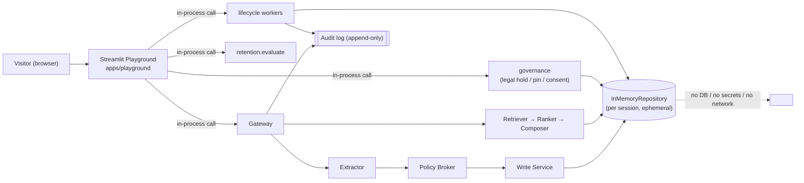

# MemoryOps AI — Playground + Hosted Demo (v0.12)

> **This is a public demo/evidence surface — not the production product.**
> The Next.js app in [`apps/web`](../apps/web) remains the official product /
> governance UI. The playground is interactive but **demo-scoped**: in-memory,
> ephemeral, no database, no auth, no secrets, no real user data.

## Why v0.12

By v0.11 MemoryOps had the full governed runtime (capture → policy → retrieval →
lifecycle workers → retention → legal hold → consent → deletion compaction →
audit) plus a typed SDK. What was still missing was a way to **understand it
without cloning the repo**.

v0.12 adds two public surfaces:

| Surface | Type | Lives in | Purpose |
|---------|------|----------|---------|
| **Playground** | Interactive | [`apps/playground/`](../apps/playground) | *Drive* the real governed lifecycle live and watch governance change behavior |
| **Results dashboard** (v0.9) | Read-only evidence | [`apps/results-dashboard/`](../apps/results-dashboard) | Static proof: lifecycle, deletion compaction, worker runtime, audit, validation |

The playground is the public **entry point**; the dashboard remains the technical
**evidence** view.

## What the playground proves (interactively)

```text
Capture → ask a question that uses memory → govern (legal hold / consent /
delete / run workers) → watch the audit trace and assistant behavior change.
```

- **Policy-before-storage** — every message shows the broker's `SAVE` /
  `DROP_LOW_UTILITY` / `BLOCK` decisions before anything is stored.
- **Legal hold (fail-closed)** — deleting a held memory is refused (the same
  HTTP 409 the API returns); release the hold to proceed.
- **Consent-aware** — withdrawing consent flips the retention outcome to
  eligible-for-deletion on the next worker run.
- **Lifecycle workers** — run decay / archive / retention / deletion verification
  / compaction over your session and see the per-job counts.
- **Auditability** — every governed action appends a content-free audit event.

## Architecture

The playground does **not** reimplement governance. It imports and drives the
exact `services/api` code the product uses, against a per-session in-memory store.



## Demo-safety model

| Concern | How it's handled |
|---------|------------------|
| Real user data | None. State is a fresh `InMemoryRepository` per browser session. |
| Persistence | None. Nothing is written to disk; a reset/reconnect starts clean. |
| Secrets / keys | None read. LLM + embeddings default to deterministic offline **stubs**. |
| Database | None. `MEMORYOPS_STORAGE=memory` (the default). |
| Auth | None needed — there is nothing sensitive to protect. |
| Cross-session leakage | Avoided — each session has its own scope `playground/visitor_<rand>`. |
| Production blast radius | Zero — the playground is isolated tooling, not on the chat request path or any deploy of the five core services. |

## Demo-only vs production-capable

- **Demo-only here:** in-memory store, ephemeral sessions, seeded sample data, a
  single anonymous scope per session, stub providers.
- **Production-capable in the real product:** Postgres + pgvector with enforced
  RLS, the worker runtime (leases/retries/dead-letter), provider LLM/embedding
  adapters, the governance UI, and the typed SDK — all already shipped in
  v0.3–v0.11. The playground is a *window* onto that behavior, not a reduced
  reimplementation of it.

## Honest limitations

- The playground is **demo-only** and **not** the production UI.
- In-memory + ephemeral by design — not a durable multi-user service.
- Inherits the project's standing honesty: deletion compaction is **not**
  crypto-shred and makes no physical disk/page-erasure guarantee.

## Screenshots

Static images live in [`docs/images/playground/`](images/playground/) and are
referenced from the main `README.md` hero section. Because capturing them needs a
live browser against a running app, the repo ships a capture guide rather than
binary placeholders — see
[`docs/images/playground/README.md`](images/playground/README.md). Hosting the
public demo and recording the GIF are the final, operator-run steps of v0.12.

## Running

See [`apps/playground/README.md`](../apps/playground/README.md). TL;DR:

```bash
cd apps/playground && pip install -r requirements.txt && streamlit run streamlit_app.py
```
